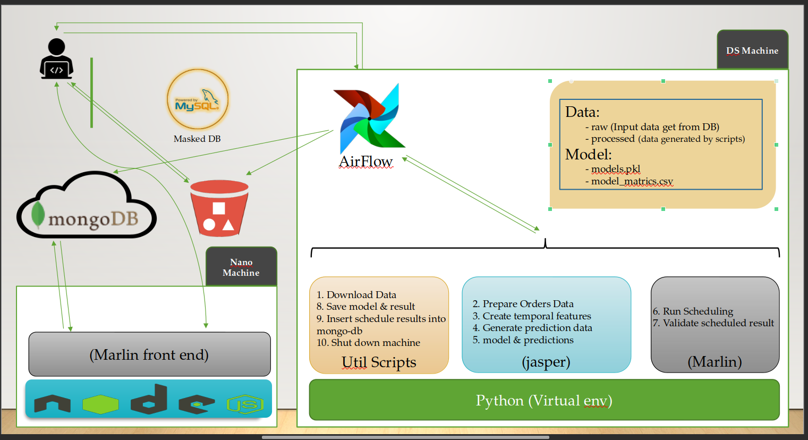

# Merlin-Jasper--Food-Recommendation

# 

<h1 align="center"> Merlin-Jasper--Food-Recommendation </h1>

  <h4> Merlin and Jasper are ML models which used to give food recommendations.</h4>

&nbsp;&nbsp;&nbsp;&nbsp;&nbsp;&nbsp;&nbsp;&nbsp;&nbsp;&nbsp;&nbsp;&nbsp;&nbsp;&nbsp;&nbsp;&nbsp;&nbsp;&nbsp;&nbsp;&nbsp;&nbsp;&nbsp;&nbsp;&nbsp;&nbsp;&nbsp;&nbsp;&nbsp;&nbsp;&nbsp;

&nbsp;&nbsp;&nbsp;&nbsp;&nbsp;&nbsp;&nbsp;&nbsp;&nbsp;&nbsp;&nbsp;&nbsp;&nbsp;&nbsp;&nbsp;&nbsp;&nbsp;&nbsp;&nbsp;&nbsp;&nbsp;&nbsp;&nbsp;&nbsp;&nbsp;&nbsp;&nbsp;&nbsp;&nbsp;&nbsp;&nbsp;&nbsp;&nbsp;&nbsp;&nbsp;

## :innocent: Overview
Our Food Recommendation System leverages advanced machine learning algorithms to provide personalized food suggestions to users. The system is built on a robust architecture that processes data, trains recommendation models, and serves these recommendations through a user-friendly interface.

## Architecture Breakdown

### Data Science Machine (DS Machine)

The core of our recommendation engine, where data is processed and machine learning models - Jasper and Marlin, are trained to generate food recommendations.

## :warning: Tech/framework used

- Apache Airflow
- Pandas
- Numpy
- Wandb
- Slack Integration
- Amazon S3

### :file_folder: Data

- `raw`: The raw input data retrieved from our databases. This data forms the basis for our recommendations.
- `processed`: Data that has been transformed and enriched by our scripts to be used for training our models.

Files:
- `models.pkl`: Serialized versions of our trained machine learning models.
- `model_metrics.csv`: Performance metrics of our models, used to track and improve their accuracy.

### Airflow

Apache Airflow manages our workflow orchestration, ensuring that our data pipelines are executed in a consistent and reliable manner.

### Utility Scripts

A collection of scripts that automate routine tasks such as:
- Downloading data
- Saving model states and results
- Inserting schedule results into MongoDB
- Shutting down machines after processes are complete

### Python Virtual Environment

Our data processing and machine learning scripts run in an isolated Python virtual environment (denoted as 'jasper') to maintain dependency integrity.

### Marlin Front End

A front-end application, named after our Marlin model, which interacts with users and displays the personalized food recommendations generated by our system.

### Python Flask

The runtime for our server-side logic, which interfaces with MongoDB and serves the Marlin front end.

### MongoDB

A NoSQL

 database used for storing and retrieving data efficiently. It plays a crucial role in managing user profiles and recommendation data.

### Nano Machine

A lightweight component of our system responsible for specific tasks that require minimal processing power.

### Masked DB

Our secure database where sensitive user data is anonymized to protect privacy while still allowing for effective data analysis.

### MySQL

A relational database that stores structured data, which might include user information, food items, and other metadata essential to the recommendation process.

## Machine Learning Models

### Jasper

Jasper is a machine learning model dedicated to understanding user preferences and dietary requirements to suggest new and exciting food options.

### Marlin

Marlin complements Jasper by optimizing the suggestions for nutritional balance and user satisfaction, using a more extensive set of data points.

## 🚀&nbsp; Workflow Description

1. **Data Ingestion**: Raw data is ingested from MongoDB and the Masked DB, ensuring a rich dataset for processing.
2. **Data Processing**: Util Scripts download and process the data, making it ready for use by the machine learning models.
3. **Model Training**: Jasper and Marlin models are trained in the Python virtual environment using the processed data.
4. **Recommendation Generation**: Models generate food recommendations, which are then stored in MongoDB.
5. **User Interaction**: Users interact with the Marlin Front End, where they receive personalized food recommendations powered by our models.
6. **Feedback Loop**: User feedback on recommendations is fed back into the system, allowing Jasper and Marlin to learn and adapt over time.

For a more detailed explanation of the data flow and system operations, refer to the architecture diagram included at the top of this document.

## :heart: Owner
Made with :heart:&nbsp;  by [Asad](https://github.com/AsadKhalil)

## :eyes: License
MIT © [Asad]()

